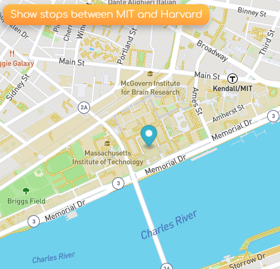

# Bus Tracker

## Tracking the bus

This exercise is meant to take real time bus information using mapbox. For this you do need to get your own access key that you can just do on their website.  

## Roadmap

I need to convert this to taking actual real time bus info. I ran out of time and only finished it with a pre inserted array of locations.

## Support
If you have any questions or concerns, shoot me an email at adriana.go1105@gmail.com

## License
This is an open source project, most of the code was provided by MIT Coding Program.

#### Here are my socials:

<a href="https://github.com/adrigalle">
    
<a href="https://www.linkedin.com/in/adriana-gallegos-a2a992159">
       

